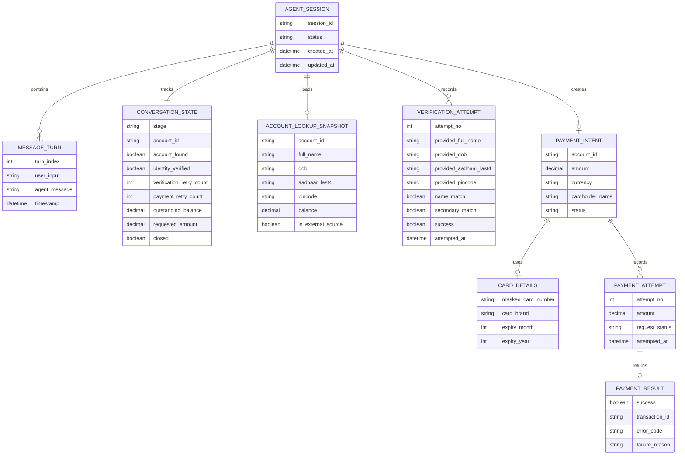

# Payment Collection Agent ERD

This document captures the first-level end-to-end ERD for the payment collection agent described in the take-home assignment.

## Scope

The assignment only requires in-memory state inside `Agent`, but this ERD shows the system as if it were modeled explicitly for production design clarity.

## ERD

## Entity Meaning

### `AGENT_SESSION`
Represents one user conversation from greeting to closure.

### `MESSAGE_TURN`
Stores each user/agent exchange handled through `Agent.next()`.

### `CONVERSATION_STATE`
Represents the current workflow position and all collected non-sensitive progress state.

### `ACCOUNT_LOOKUP_SNAPSHOT`
Stores the account details returned by the lookup API and used internally for verification. Sensitive fields should never be echoed back to the user.

### `VERIFICATION_ATTEMPT`
Tracks each verification try, what the user provided, and whether the strict verification logic succeeded.

### `PAYMENT_INTENT`
Represents the payment the user wants to make after verification succeeds.

### `CARD_DETAILS`
Represents card data needed for payment processing. In implementation, raw values should be short-lived and not logged.

### `PAYMENT_ATTEMPT`
Tracks each call to the payment API.

### `PAYMENT_RESULT`
Captures the final outcome from the payment API, either success with transaction ID or failure with error code.

## Relationship Summary

- One `AGENT_SESSION` contains many `MESSAGE_TURN` records.
- One `AGENT_SESSION` has one active `CONVERSATION_STATE`.
- One `AGENT_SESSION` may load one `ACCOUNT_LOOKUP_SNAPSHOT` after account lookup.
- One `AGENT_SESSION` may have multiple `VERIFICATION_ATTEMPT` records.
- One `AGENT_SESSION` may create one `PAYMENT_INTENT` for the current flow.
- One `PAYMENT_INTENT` may reference one `CARD_DETAILS` object.
- One `PAYMENT_INTENT` may result in multiple `PAYMENT_ATTEMPT` records if retries are allowed.
- Each `PAYMENT_ATTEMPT` produces one `PAYMENT_RESULT`.

## Implementation Note

For this assignment, these entities do not need a real database. The practical implementation can use Python dataclasses held in memory inside the `Agent` instance while still following this structure.
